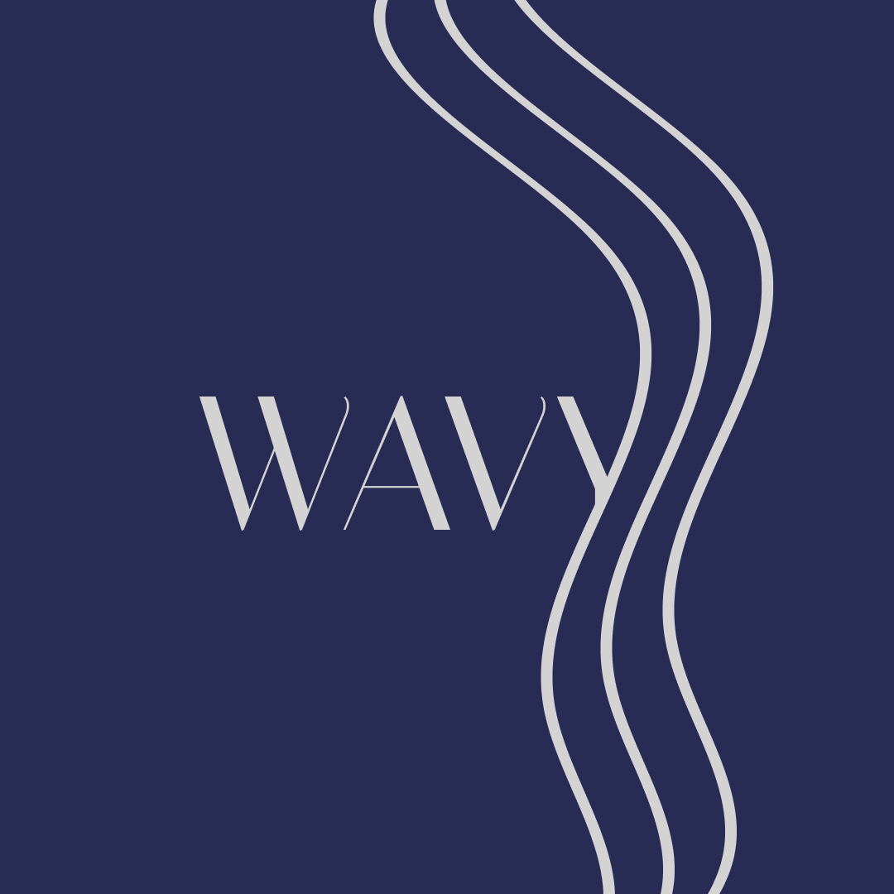

# PROJETO 1: CONSTRUINDO A COMUNICAÇÃO VISUAL DO PRODUTO

## 📜 Introdução (Briefing de Cliente)

Você foi contratado por uma startup de tecnologia para criar **toda a base visual do seu novo produto**.

A empresa quer transmitir **modernidade**, **acessibilidade** e **inovação**.

O produto será uma **plataforma para gerenciar equipes remotas**.

---

### 📛 Nome: **Wavy**

O nome **Wavy** vem da palavra inglesa *wave* (onda) e carrega múltiplos significados:

- 🔄 Representa **fluxo constante de tarefas** e **conexão entre membros da equipe**.
- 🌐 Simboliza a **rede digital** em que os usuários colaboram.
- 🧭 Inspira **leveza, movimento e flexibilidade** — qualidades fundamentais no trabalho remoto.
- 🧘‍♂️ Retrata **um nome leve, sonoro e fácil de memorizar** — em qualquer idioma.
---

### 🎨 Cores

| Cor | Código Hexadecimal | Justificativa |
| --- | --- | --- |
| Azul Petróleo | #282B54 | Um tom moderno de azul que passa inovação e seriedade ao mesmo tempo |
| Branco | #D3D3D3 | Reforça limpeza, funcionalidade e minimalismo |

---

### 🔠 Tipografia

| Fonte | Estilo | Aplicação |
| --- | --- | --- |
| Italiana | Transmite sofisticação e elegância | Títulos |

---

### 🖼️ Elementos Visuais

O símbolo da **onda** é usado como identidade gráfica em planos de fundo, ícones e na marca. Ele representa:

- 🌊 Conexão e fluxo entre tarefas
- 🧠 Pensamento em rede e integração
- ✨ Movimento contínuo, como o trabalho remoto ideal

---

## 📦 Aplicações Visuais

- ✅ Logotipo principal e reduzido
- ✅ Interface UI com hierarquia de cores e espaçamentos claros
- ✅ Elementos gráficos suaves e integrados ao conceito de "fluxo"
- ✅ Branding aplicado a cards, landing page e app

---

## 🚀 Conclusão

**Wavy** é mais do que uma plataforma — é uma forma de pensar o trabalho remoto como algo natural, dinâmico e conectado. Sua identidade visual reflete exatamente isso: **fluidez com propósito**, **elegância sem complicação**, e **tecnologia com empatia**.

Trabalho feito por: Evilen Barreto, Ana Julia Barros e Jovêncio Neto.
